# Use Case Diagram - AI Fashion Shop

```mermaid
graph TB
    %% Actors
    Customer[👤 Customer]
    Admin[👨‍💼 Admin]
    Guest[👥 Guest]
    PaymentSystem[💳 Payment System]
    ShippingService[🚚 Shipping Service]
    
    %% Use Cases - Authentication
    subgraph "🔐 Authentication"
        UC1[Register Account]
        UC2[Login]
        UC3[Logout]
        UC4[Reset Password]
    end
    
    %% Use Cases - Product Management
    subgraph "📦 Product Management"
        UC5[Browse Products]
        UC6[Search Products]
        UC7[AI Smart Search]
        UC8[View Product Details]
        UC9[Add Product]
        UC10[Update Product]
        UC11[Delete Product]
        UC12[Manage Categories]
        UC13[Manage Inventory]
    end
    
    %% Use Cases - Shopping
    subgraph "🛒 Shopping"
        UC14[Add to Cart]
        UC15[View Cart]
        UC16[Update Cart]
        UC17[Remove from Cart]
        UC18[Checkout]
        UC19[Apply Promotion]
    end
    
    %% Use Cases - Order Management
    subgraph "📋 Order Management"
        UC20[Place Order]
        UC21[View Order History]
        UC22[Track Order]
        UC23[Cancel Order]
        UC24[Manage Orders]
        UC25[Update Order Status]
    end
    
    %% Use Cases - Payment
    subgraph "💰 Payment"
        UC26[Process Payment]
        UC27[Refund Payment]
        UC28[View Payment History]
    end
    
    %% Use Cases - Shipping
    subgraph "🚛 Shipping"
        UC29[Calculate Shipping]
        UC30[Schedule Delivery]
        UC31[Update Shipping Status]
        UC32[Track Shipment]
    end
    
    %% Use Cases - Review & Rating
    subgraph "⭐ Review & Rating"
        UC33[Write Review]
        UC34[Rate Product]
        UC35[View Reviews]
        UC36[Moderate Reviews]
    end
    
    %% Use Cases - User Management
    subgraph "👥 User Management"
        UC37[View Profile]
        UC38[Update Profile]
        UC39[Manage Users]
        UC40[Assign Roles]
    end
    
    %% Use Cases - Analytics & Reports
    subgraph "📊 Analytics & Reports"
        UC41[View Sales Report]
        UC42[View User Analytics]
        UC43[View Product Analytics]
        UC44[AI Search Analytics]
    end
    
    %% Guest Relationships
    Guest --> UC5
    Guest --> UC6
    Guest --> UC7
    Guest --> UC8
    Guest --> UC1
    Guest --> UC2
    Guest --> UC35
    
    %% Customer Relationships
    Customer --> UC2
    Customer --> UC3
    Customer --> UC4
    Customer --> UC5
    Customer --> UC6
    Customer --> UC7
    Customer --> UC8
    Customer --> UC14
    Customer --> UC15
    Customer --> UC16
    Customer --> UC17
    Customer --> UC18
    Customer --> UC19
    Customer --> UC20
    Customer --> UC21
    Customer --> UC22
    Customer --> UC23
    Customer --> UC26
    Customer --> UC28
    Customer --> UC32
    Customer --> UC33
    Customer --> UC34
    Customer --> UC35
    Customer --> UC37
    Customer --> UC38
    
    %% Admin Relationships
    Admin --> UC2
    Admin --> UC3
    Admin --> UC9
    Admin --> UC10
    Admin --> UC11
    Admin --> UC12
    Admin --> UC13
    Admin --> UC24
    Admin --> UC25
    Admin --> UC27
    Admin --> UC31
    Admin --> UC36
    Admin --> UC39
    Admin --> UC40
    Admin --> UC41
    Admin --> UC42
    Admin --> UC43
    Admin --> UC44
    
    %% External System Relationships
    PaymentSystem --> UC26
    PaymentSystem --> UC27
    ShippingService --> UC29
    ShippingService --> UC30
    ShippingService --> UC31
    
    %% Include Relationships
    UC18 -.->|include| UC26
    UC20 -.->|include| UC29
    UC20 -.->|include| UC26
    UC7 -.->|include| UC6
    
    %% Extend Relationships
    UC19 -.->|extend| UC18
    UC4 -.->|extend| UC2
```

## 📋 Mô tả Use Cases

### 🔐 **Authentication & Authorization**
- **UC1-UC4**: Quản lý đăng nhập, đăng ký, đăng xuất
- Hỗ trợ reset password cho user quên mật khẩu

### 📦 **Product Management** 
- **UC5-UC8**: Khách hàng xem, tìm kiếm sản phẩm
- **UC7**: **AI Smart Search** - tính năng tìm kiếm thông minh
- **UC9-UC13**: Admin quản lý sản phẩm, danh mục, tồn kho

### 🛒 **Shopping Experience**
- **UC14-UC19**: Quản lý giỏ hàng và thanh toán
- Hỗ trợ áp dụng mã khuyến mãi

### 📋 **Order & Fulfillment**
- **UC20-UC25**: Đặt hàng, theo dõi, quản lý đơn hàng
- Tích hợp với hệ thống thanh toán và vận chuyển

### ⭐ **Customer Engagement**
- **UC33-UC36**: Đánh giá, review sản phẩm
- Admin có thể kiểm duyệt review

### 📊 **Analytics & Reporting**
- **UC41-UC44**: Báo cáo doanh số, phân tích người dùng
- Phân tích hiệu quả tìm kiếm AI

## 👥 **Actors**
- **Guest**: Khách vãng lai (chưa đăng ký)
- **Customer**: Khách hàng đã đăng ký
- **Admin**: Quản trị viên hệ thống
- **External Systems**: Payment & Shipping services